# Acceleration Structure Benchmark

So I wanted to implement an acceleration structure for my game engine. We had an octree acceleration structure at my previous workplace, so I thought that it must be a good fit for me as well. Anyway, I implemented a couple of others just for the sake of comparison.

1) Linear Acceleration Structure;
2) Octree Acceleration Structure;
3) Quadtree Acceleration Structure.

Here's the set of methods I want each of them to have:

1) Add (expected to happen a lot on loading, rare* on runtime);
2) Update (expected to happen rare* on runtime);
3) AABBox Query (not sure if I really need it);
4) Frustum Query (expected to happen a few times a frame);
5) Remove (expected to happen rare* on runtime).

*\* — when I say "rare" I mean about a couple of hundred times or less.*

## Add

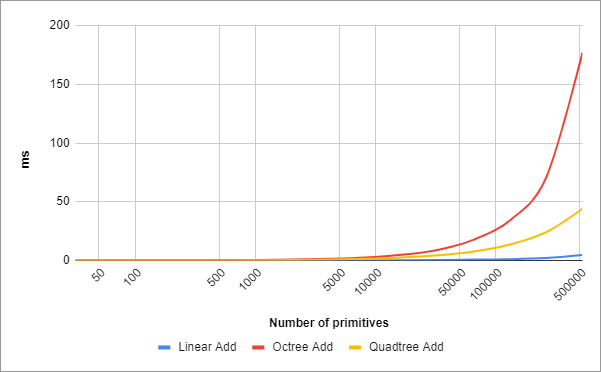

Adding to a linear acceleration structure is very fast. A quadtree is more linear than an octree (for max depth equal to 6, the maximum number of nodes in the former is 50 times less than in the latter), so adding to a quadtree is expectedly faster.

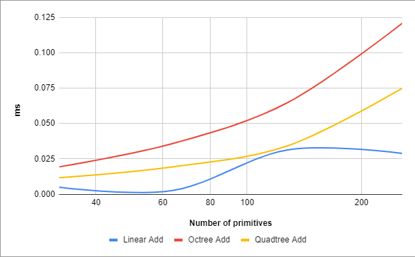

This is the expected maximum number of primitives added every frame. Same story here, but way shorter timings.

## Update

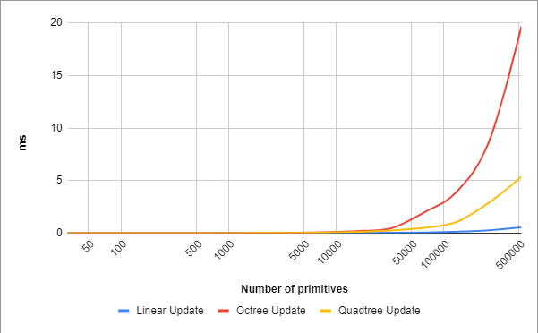

Linear acceleration structure's update is a no-op. Object movement along Y-axis doesn't change its hierarchical node for quadtree. Internally Update uses Add and Remove operations which are still faster for a quadtree than for an octree.

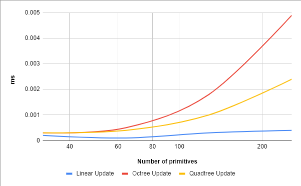

This is the expected maximum number of primitives updated every frame. Same story here, but way shorter timings.

## AABBox Query

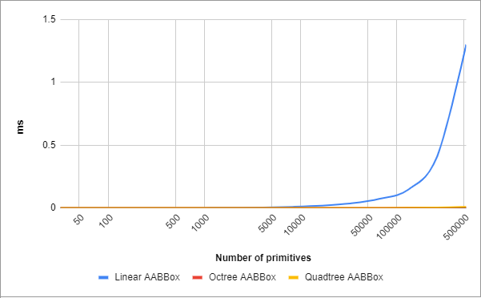

Here we can see why acceleration structures are needed. They are so much faster.

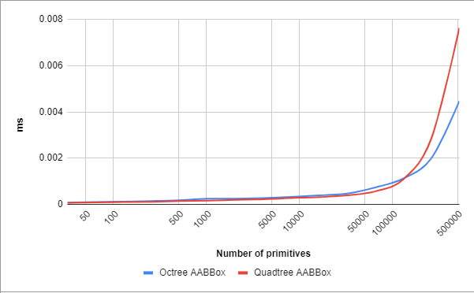

Only hierarchical acceleration structures. Octree works better than quadtree in high density.

## Frustum Query

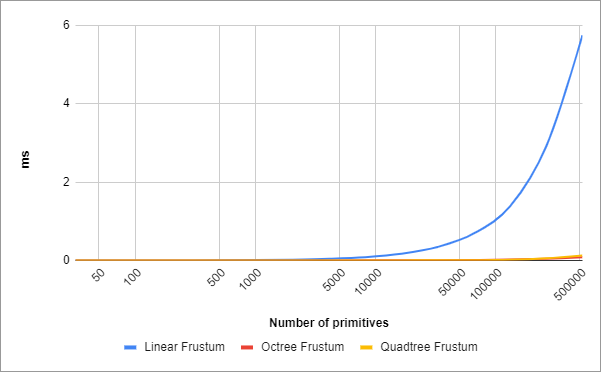

Again, traversing over all primitives for frustum culling is a bad option.

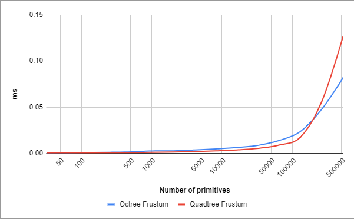

Only hierarchical acceleration structures. Octree works better in high density.

## Remove

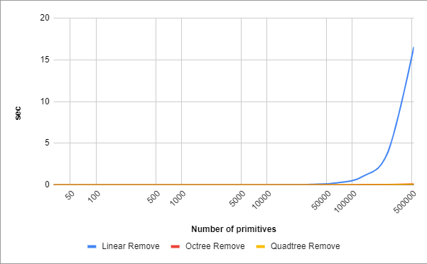

Removing 500k objects from linear acceleration structure is very slow considering its O(n²) complexity.

Only hierarchical acceleration structures. Note that the previous picture's vertical axis was in seconds, and now it's in milliseconds.

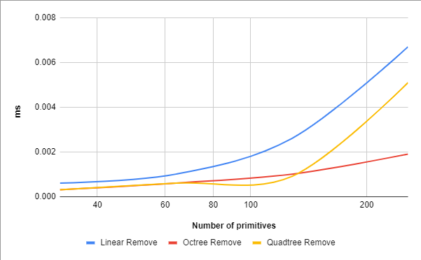

This is the expected maximum number of primitives removed every frame. The creepy timings from previous charts are gone.

## Memory Usage

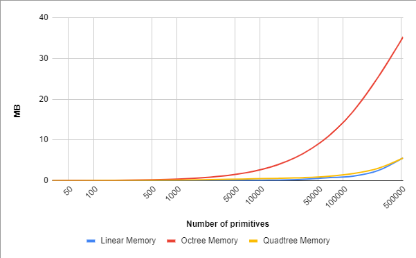

Octree uses over 6 times more memory than both linear and quadtree acceleration structures.

## Choosing depth

Each hierarchical acceleration structure has the maximum number of depth levels. Changing this maximum changes every single chart, so I won't add more of them here, instead go check the first link in the references section for Google Sheets document. Two important properties that I tried to balance when choosing the maximum depth were the memory usage and frustum query timing.

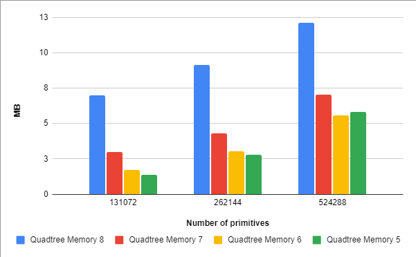

6 depth levels use as much memory as 5 depth levels.

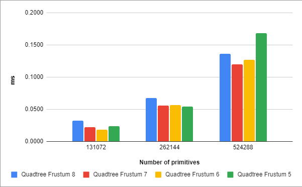

Frustum query for 6 depth levels takes as long as frustum query for 7 depth levels.

## Conclusion

Go for quadtree acceleration structure with 6 depth levels unless your game levels are very vertical.

## References

https://docs.google.com/spreadsheets/d/1l6W-gt6phe4eNsyfEGpsTosnCsr5HutFKGUKXixj6mU/edit

https://fgiesen.wordpress.com/2010/10/17/view-frustum-culling/

http://www8.cs.umu.se/kurser/5DV051/HT12/lab/plane_extraction.pdf
