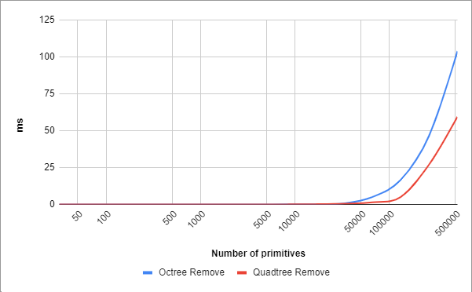

# Acceleration Structure Benchmark

So I wanted to implement an acceleration structure for my game engine. We had an octree acceleration structure at my previous workplace, so I thought that it must be a good fit for me as well. Anyway, I implemented a couple of others just for the sake of comparison.

1) Linear Acceleration Structure;
2) Octree Acceleration Structure;
3) Quadtree Acceleration Structure.

Here's the set of methods I want each of them to have:

1) Add (expected to happen a lot on loading, rare* on runtime);
2) Update (expected to happen rare* on runtime);
3) AABBox Query (not sure if I really need it);
4) Frustum Query (expected to happen a few times a frame);
5) Remove (expected to happen rare* on runtime).

*\* — when I say "rare" I mean about a couple of hundred times per frame or less.*

## Add

Adding to a linear acceleration structure is very fast. A quadtree is more linear than an octree (for max depth equal to 6, the maximum number of nodes in the former is 50 times less than in the latter), so adding to a quadtree is expectedly faster.

This is the expected maximum number of primitives added every frame. Same story here, but way shorter timings.

## Update

Linear acceleration structure's update is a no-op. Object movement along Y-axis doesn't change its hierarchical node for quadtree. Internally update uses add and remove operations which are still faster for a quadtree than for an octree.

This is the expected maximum number of primitives updated every frame. Same story here, but way shorter timings.

## AABBox Query

Here we can see why acceleration structures are important. They perform queries **a few hundred times** faster.

Same but only hierarchical acceleration structures. An octree outperforms a quadtree in my test. I test up to 500k objects uniformly distributed in a cube with a side length of 1024m. Hence the objects are uniformly distributed on Y-axis. This means that an octree node will contain much fewer objects than a quadtree node. Most games are not very vertical though, the objects are usually uniformly distributed on X and Z axes, in which case quadtree would outperform an octree.

## Frustum Query

Same conclusion as for AABBox Query.

Same conclusion as for AABBox Query.

## Remove

Removing 500k objects from linear acceleration structure is very slow considering its O(n²) complexity.

Only hierarchical acceleration structures. Note that the previous picture's vertical axis was in seconds, and now it's in milliseconds.

This is the expected maximum number of primitives removed every frame. The creepy timings from previous charts are gone.

## Memory Usage

Octree uses over 6 times more memory than both linear and quadtree acceleration structures.

## Choosing depth

Each hierarchical acceleration structure has the maximum number of depth levels. Two important properties that I tried to balance when choosing the maximum depth were memory usage and frustum query timing. For other charts check the first link in the references section.

6 depth levels use as much memory as 5 depth levels.

Frustum query for 6 depth levels takes as long as frustum query for 7 depth levels.

## Conclusion

So my initial assumption that I should go for an octree was wrong. An octree takes much more memory and outperforms a quadtree only on vertical game levels. It's a good idea though to leave an option which acceleration structure to use (perhaps it could be different not only from game to game but from level to level as well?). Linear acceleration structure expectedly sucks.

## References

https://docs.google.com/spreadsheets/d/1l6W-gt6phe4eNsyfEGpsTosnCsr5HutFKGUKXixj6mU/edit

https://fgiesen.wordpress.com/2010/10/17/view-frustum-culling/

http://www8.cs.umu.se/kurser/5DV051/HT12/lab/plane_extraction.pdf
